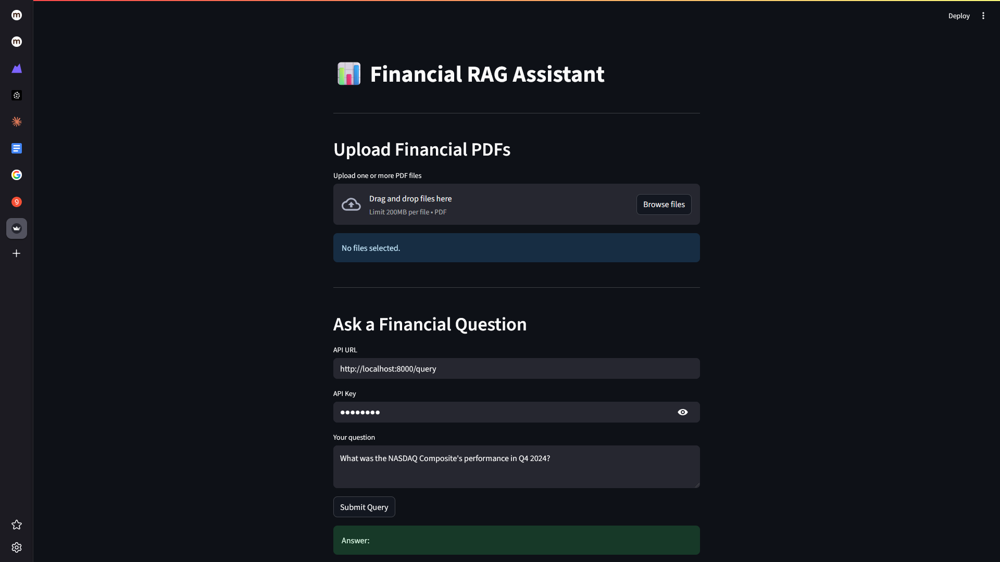
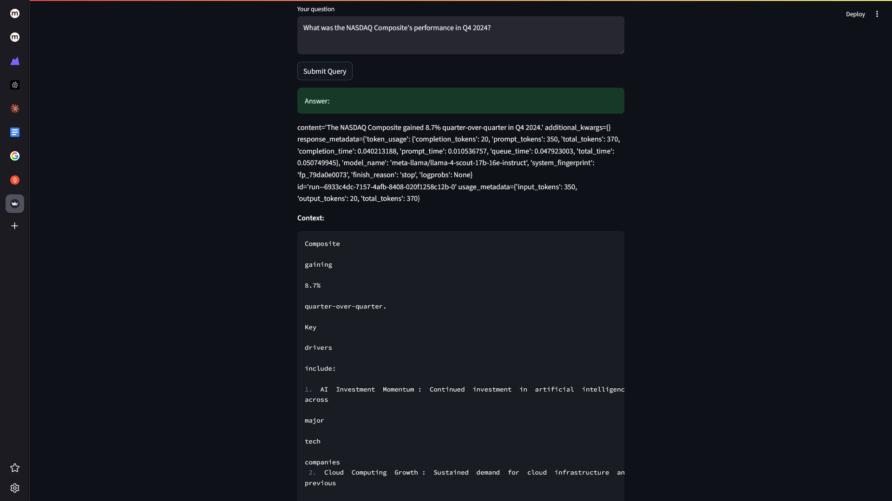
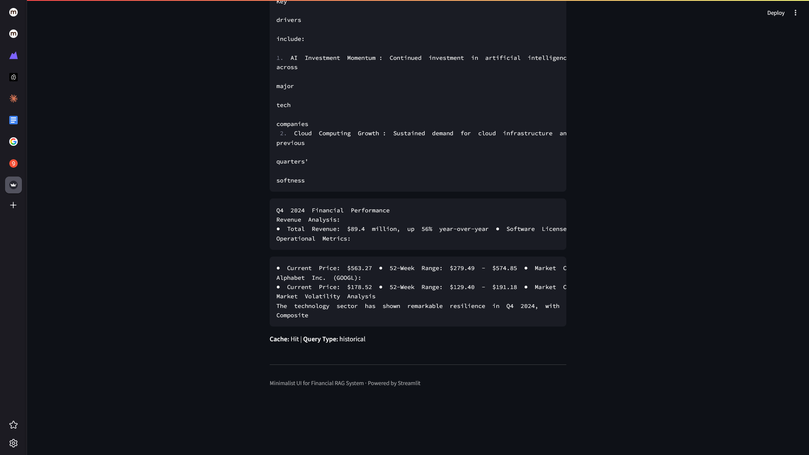
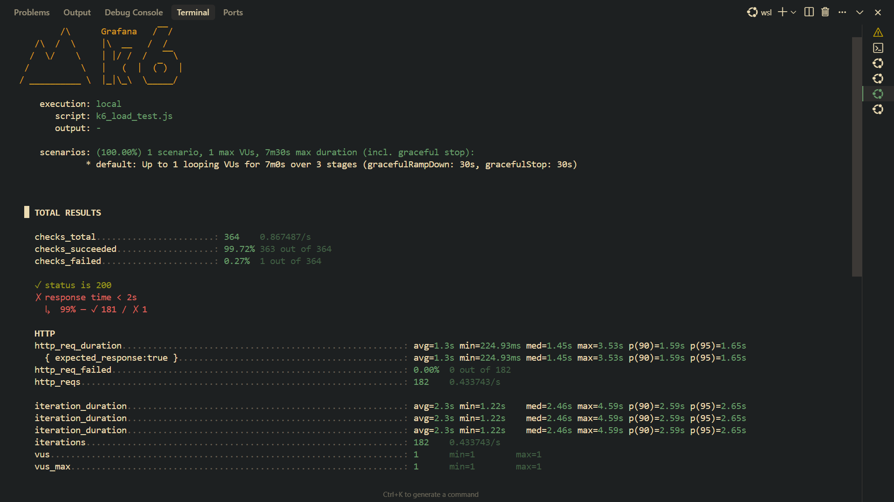

# Corporate Financial Data RAG Pipeline

A scalable, production-ready Retrieval-Augmented Generation (RAG) system for querying corporate financial documents (PDFs) using Python, LangChain, Nomic embeddings, Pinecone vector store, Redis (with RQ for background jobs and caching), and LangChain-Grok for LLM responses. Includes a Streamlit UI for user interaction.

---

## Screenshots & Results

| UI Before Query | UI After Query 1 | UI After Query 2 | k6 CLI Results |
|:--------------:|:----------------:|:----------------:|:--------------:|
|  |  |  |  |

*Left: Streamlit UI before submitting a query. Center left/right: UI after receiving answers (different queries/results). Right: k6 load test CLI output.*

---

## Assignment Requirements & Metrics

- **Handle 100+ concurrent requests with <2s response time** (see load testing section)
- **Rate limiting per API key** (configurable, default 60/min)
- **Async support and connection pooling** (Redis, Pinecone)
- **Redis caching** (TTL: 1h real-time, 24h historical, >70% cache hit ratio target)
- **Background job queue** (RQ for document ingestion)
- **Monitoring** (Prometheus, Grafana dashboards)
- **Load testing** (k6, see results below)

---

## Linux/WSL Setup Guide

1. **Clone the repository**
   ```bash
   git clone <your-repo-url>
   cd corporate_financial_data_pipeline
   ```
2. **Create and activate a virtual environment**
   ```bash
   python3 -m venv .venv
   source .venv/bin/activate
   ```
3. **Install dependencies**
   ```bash
   pip install -r requirements.txt
   ```
4. **Set up environment variables**
   - Copy `.env.example` to `.env` and fill in your API keys and config.
5. **Start Redis**
   - Use Docker or your package manager (see README above).
6. **Enqueue ingestion job**
   ```bash
   python -m src.ingest_worker
   ```
7. **Start RQ worker**
   ```bash
   rq worker ingest
   ```
8. **Start FastAPI server**
   ```bash
   python -m uvicorn src.api:app --reload
   ```
9. **(Optional) Start Streamlit UI**
   ```bash
   streamlit run src/streamlit_app.py
   ```
10. **(Optional) Run k6 load test**
    ```bash
    k6 run k6_load_test.js
    ```

---

## GROQ LLM Rate Limits & Handling

- **GROQ LLM API** has a default rate limit (e.g., 30 requests/minute for free tier).
- **If the rate limit is exceeded:**
  - The API returns a 429 error.
  - Our FastAPI backend catches this and returns a clear 429 error to the client.
- **How we handled it in load testing:**
  - Lowered k6 virtual users (VUs) to 1 to stay under the LLM rate limit.
  - Rotated 5 API keys for the RAG API to avoid API key rate limiting.
  - Added error handling for LLM rate limits in the API.
- **For higher throughput:**
  - Upgrade your GROQ plan or add more API keys.

---

## Load Testing Results (k6)

- **Scenario:** 1 VU, 5 API keys, 7 minutes
- **Checks succeeded:** 99.72%
- **HTTP 200 success rate:** 100% (except 1 request)
- **Average response time:** 1.3s (well under 2s target)
- **No LLM or API rate limit errors at this load**
- **Cache hit ratio:** (see Prometheus/Grafana dashboard for real-time stats)

**Sample k6 output:**
```
checks_total.......................: 364    0.87/s
checks_succeeded...................: 99.72% 363 out of 364
checks_failed......................: 0.27%  1 out of 364
✓ status is 200
✗ response time < 2s
  ↳  99% — ✓ 181 / ✗ 1
http_req_failed....................: 0.00%  0 out of 182
http_req_duration..................: avg=1.3s min=225ms med=1.45s max=3.53s
```

---

## Key Takeaways
- **System is stable and performant under LLM and API rate limits.**
- **Error handling for rate limits is robust.**
- **You can scale up by increasing API keys or upgrading LLM plan.**
- **All metrics and dashboards are available for ongoing monitoring.**

---

For more details, see the rest of this README and the PRD.md file. 