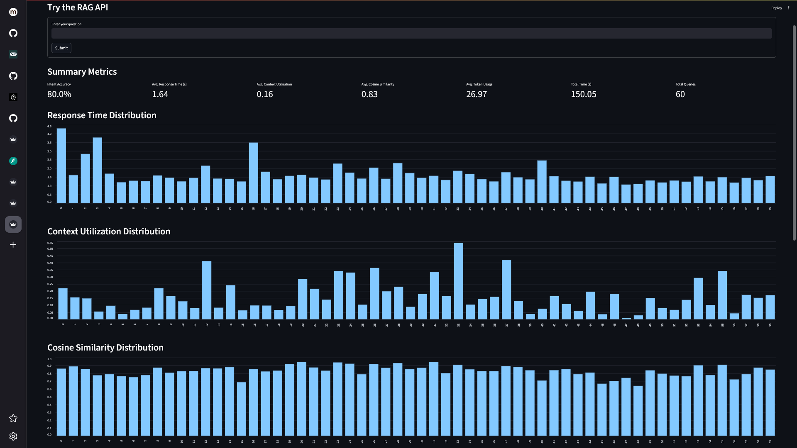
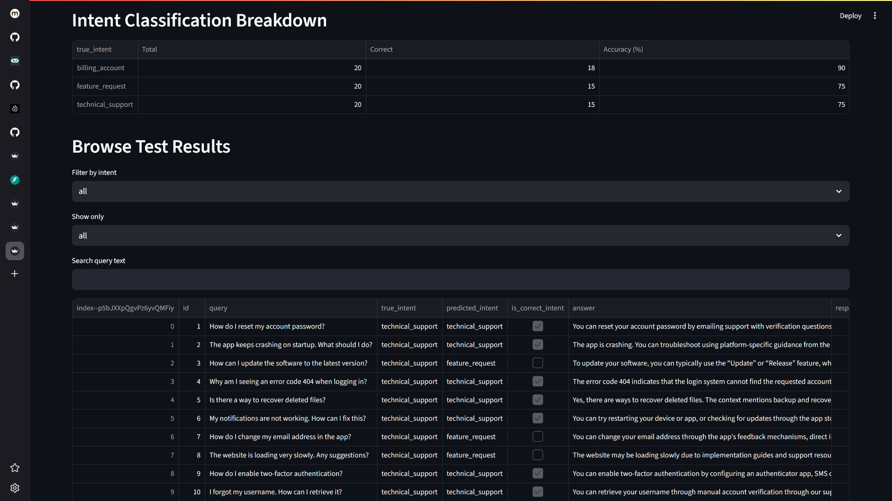

# Local RAG Pipeline with Intent Detection and Evaluation

## Background

This project implements a customer support system for a SaaS company that intelligently handles different query types—technical issues, billing questions, and feature requests—using tailored retrieval-augmented generation (RAG) strategies and local LLMs. The system features intent detection, dynamic routing, evaluation metrics, and a web dashboard.

---

## Features

- **Local LLM Setup:**  
  - Uses Ollama for local LLM inference (e.g., gemma3:1b).
  - API wrapper supports switching between local Llama and OpenAI/GROQ for fallback and A/B testing.
  - Request queuing for concurrent LLM requests.

- **Intent Detection System:**  
  - Classifies queries into three categories:
    - **Technical Support:** Routes to code examples, documentation.
    - **Billing/Account:** Routes to pricing tables, policies.
    - **Feature Requests:** Routes to roadmap, comparison data.
  - Each intent uses different prompt templates and retrieval strategies.

- **Evaluation Framework:**  
  - Test set: 20 queries per intent (60 total).
  - Metrics:
    - Intent classification accuracy
    - Response relevance (cosine similarity)
    - Context utilization score
    - Response time and token usage
  - Dashboard for visualizing metrics and browsing results.

- **Web UI:**  
  - Streamlit dashboard for evaluation and live querying.
  - Simple form to test the `/rag/query` endpoint.

- **API:**  
  - FastAPI backend with endpoints for LLM requests, RAG queries, and result retrieval.
  - CORS enabled for local development.

- **Other:**  
  - Streaming support for long responses.
  - Modular, extensible codebase.

---

## Project Structure

```
intent_detection_and_evaluation/
│
├── src/
│   ├── api/
│   │   └── llm_router.py         # API wrapper for LLMs
│   ├── intent/
│   │   └── classifier.py         # Intent detection logic
│   ├── retrieval/
│   │   └── retriever.py          # RAG logic, prompt templates, chains
│   ├── dashboard.py              # Streamlit dashboard
│   ├── main.py                   # FastAPI entrypoint
│   └── ...                       # Other modules
│
├── data/
│   ├── test_set.json             # Test queries for evaluation
│   ├── eval_results.json         # Evaluation results
│   └── ...
│
├── requirements.txt
├── README.md
└── PRD.md
```

---

## Setup Instructions

1. **Install dependencies:**
   ```bash
   pip install -r requirements.txt
   ```

2. **Set up environment variables:**
   - Copy `.env.example` to `.env` and fill in your API keys (Ollama, Pinecone, etc.).

3. **Start the FastAPI backend:**
   ```bash
   cd intent_detection_and_evaluation
   uvicorn src.main:app --reload --host 0.0.0.0 --port 8000
   ```

4. **Run the Streamlit dashboard:**
   ```bash
   streamlit run src/dashboard.py
   ```

5. **(Optional) Run evaluation:**
   ```bash
   python -m src.evaluate
   ```

---

## API Endpoints

- `POST /rag/query`  
  Request: `{ "question": "How do I reset my password?" }`  
  Response: `{ "intent": "technical_support", "answer": "..." }`

- `POST /llm/request`  
  Request: `{ "question": "...", "backend": "ollama" }`  
  Response: `{ "job_id": "...", "intent": "..." }`

- `GET /llm/result/{job_id}`  
  Fetches the result of a queued LLM request.

---

## Evaluation Report

**Test Set:** 60 queries (20 per intent)

**Results:**
- **Intent Classification Accuracy:** 78.3%
- **Average Response Time:** 1.78 seconds
- **Total Evaluation Time:** 106.6 seconds

Example (from `data/eval_results.json`):
```json
{
  "intent_accuracy": 0.783,
  "avg_response_time": 1.78,
  "total_time": 106.6,
  "total": 60
}
```

---

## Sample Test Queries

See `data/test_set.json` for the full set. Example:
```json
[
  { "id": 1, "query": "How do I reset my account password?", "intent": "technical_support" },
  { "id": 21, "query": "How do I update my billing information?", "intent": "billing_account" },
  { "id": 41, "query": "Can you add support for exporting data to Excel?", "intent": "feature_request" }
]
```

---

## A/B Testing

- The API wrapper allows switching between local Llama (Ollama) and OpenAI/GROQ for A/B testing.
- Set the `BACKEND` environment variable in API or evaluation requests to select the LLM.
- **Note:** The dashboard only displays results for the default backend (the latest evaluation in `data/eval_results.json`).
- If you want to view results for a different backend, copy or rename the corresponding results file (e.g., `eval_results_ollama.json` or `eval_results_groq.json`) to `eval_results.json` before launching the dashboard.
- A/B comparison is not shown in the dashboard, but you can compare results manually by switching files.

---


## Web UI


- The Streamlit dashboard (`src/dashboard.py`) provides:
  - A form to test the `/rag/query` endpoint live.
  - Visualizations of evaluation metrics.
  - Browsing and filtering of test results.
  - **Note:** Only the results for the default backend (latest evaluation) are shown.





---

## Example Usage

**Query via Streamlit UI:**
- Enter a question in the dashboard form and view the detected intent and answer.

**Query via API:**
```python
import requests
response = requests.post("http://localhost:8000/rag/query", json={"question": "How do I reset my password?"})
print(response.json())
```

---

## License

MIT 